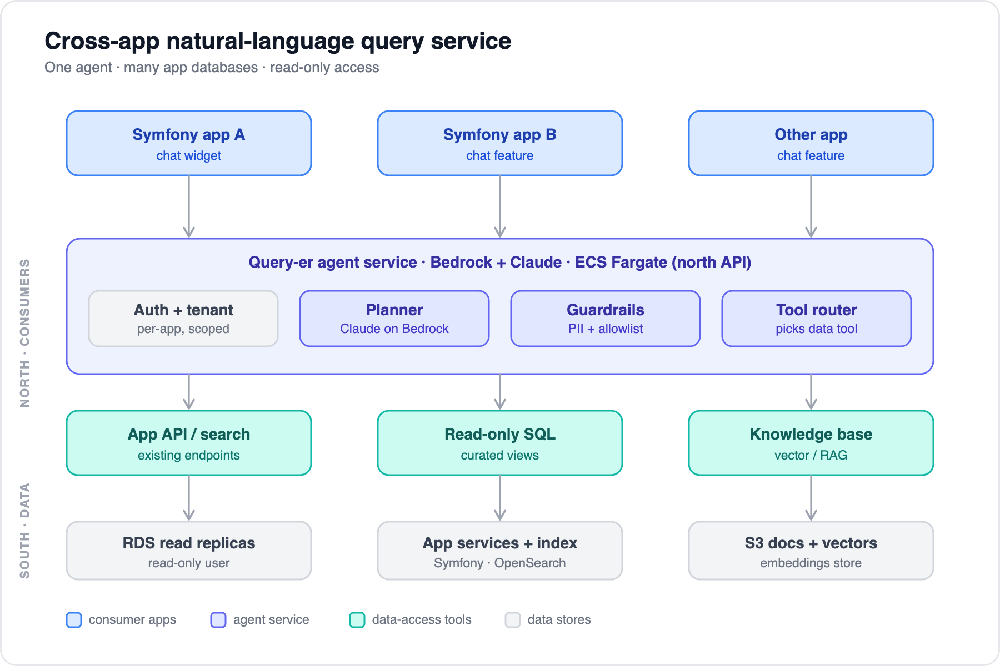

# 01 — Architecture overview

[← Back to index](../README.md) · Next: [02 — Data access options](02-data-access-options.md)

---

## The problem

We have several applications in **one AWS account**, each running on **ECS** with **its own database** (RDS/Aurora, Doctrine ORM). Most backends are **Symfony**; one may be another language. We want users to ask questions in natural language inside any app's chat feature and get answers drawn from that app's data — and eventually across apps.

The tempting shortcut is to point an LLM at the production tables and let it write SQL. That's the riskiest default: it bypasses each app's authorization and multi-tenancy, leaks schema, and turns a hallucinated `JOIN` into a data-exposure incident. The robust approach treats data access as a set of **guarded tools**, reusing the query and permission logic the apps already enforce.

## Think in two integration surfaces

Every design decision is either about how consumers reach the service, or how the service reaches data. Keeping them separate is what makes this tractable.



### North surface — consumers → service
How each app's chat feature calls the agent: **one HTTPS/streaming endpoint**, one auth model. The app passes **who is asking** and **in what tenant/scope**, derived from its own authenticated session. The model never decides identity.

```
POST /v1/query
Authorization: <app service token>
{
  "app": "billing",
  "tenant_id": "acme-co",        // from the app's verified session — trusted
  "user_id": "u_123",
  "scopes": ["billing:read"],    // what this user may see
  "question": "how many overdue invoices this month?"
}
→ streams: { answer, citations[], tool_calls[], audit_id }
```

The golden rule: `tenant_id` / `scopes` are **trusted** (from the app session); `question` is **untrusted** input.

### South surface — service → data
How the agent reaches each app's data. This is where the three data-access strategies live ([doc 02](02-data-access-options.md)) and where the security work concentrates ([doc 05](05-aws-deployment-and-security.md)). Apps onboard to the north surface once; you evolve south-side access per app independently.

## The components

| Component | Role |
|---|---|
| **Chat features** (in each app) | Call the north API; render streamed answers |
| **Query-er agent service** | Bedrock + Claude; auth, tenant scoping, planning, guardrails, tool routing, audit. A **new microservice** — not part of any Symfony app, and need not be PHP. |
| **Data-access tools** | Per-app: existing API/search, guarded read-only SQL, or a vector knowledge base |
| **Data stores** | RDS read replicas, app services + search indexes, embeddings store |

A few facts that shape everything downstream:

- **Bedrock's model API is not an MCP client.** The Converse model speaks `tool_use`/`tool_result`; a *host* (AgentCore Gateway, Strands, or your own loop) is always the MCP client that translates tools and runs the loop. Plan for that host explicitly — see [doc 04](04-query-routing-options.md).
- **Transport is Streamable HTTP** (MCP `2025-11-25`), not the deprecated HTTP+SSE.
- **Cross-app is a goal, but staged.** A chat in one app should reach its home app's data *and* an allowlisted set of other apps (all internal, same account), with every read running as the asking user. Start with the home app to prove the loop, then turn on the cross-app bundle — see [doc 04](04-query-routing-options.md#our-case--cross-app-tool-bundles-per-feature).
- **The agent is one consumer of a read-only interop layer.** Apps also consume it directly (e.g. one app's list populating another's form field), and cross-app entity resolution ties it together — see [doc 09](09-interop-and-entity-resolution.md).

---

Next: [02 — Data access options](02-data-access-options.md)
