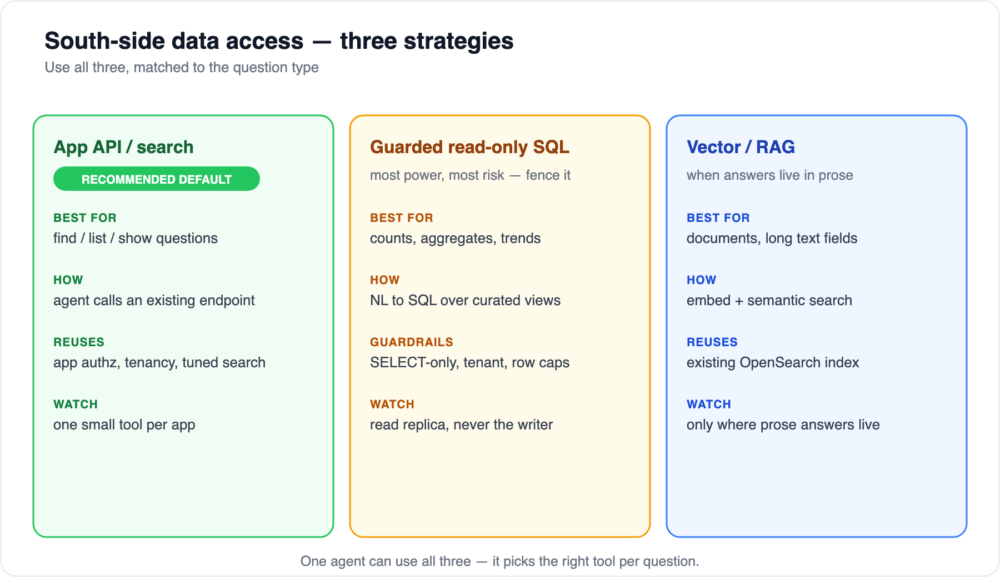

# 02 — Data access options

[← 01 Architecture](01-architecture-overview.md) · [Index](../README.md) · Next: [03 — Exposing apps as MCP](03-exposing-apps-as-mcp.md)

---

How does the agent actually reach an app's data? There are three strategies. They aren't mutually exclusive — a single agent uses **all three**, picking the right one per question.



## 1. App API / search — the recommended default

The agent calls an app's **existing endpoint or repository method** as a tool: `search_invoices`, `get_customer`, `aggregate_orders`. The app runs the query the way it always has.

- **Best for:** find / list / show questions — anything the app already answers.
- **Why it wins:** it reuses the app's authorization, multi-tenancy, and tuned relevance. In a multi-tenant Symfony app, your repositories and voters already enforce "user X sees only tenant Y's rows." API access keeps that; raw SQL throws it away.
- **Cost:** you expose a small, deliberate set of tools per app (a controller method + a tool definition).

If an app already has **OpenSearch/Elasticsearch** (e.g. FOSElastica), expose *that* as the primary `search_*` tool — you inherit relevance tuning for free.

## 2. Guarded read-only SQL (NL→SQL) — powerful, fence it tightly

The agent generates SQL that runs against **curated views on a read replica**.

- **Best for:** ad-hoc analytics the typed tools don't cover — counts, aggregates, trends.
- **The danger:** this is the most flexible and the most dangerous path. Without strict fencing, NL→SQL leaks across tenants and runs expensive queries.
- **Mandatory guardrails:** SELECT-only; allowlisted **views** (not base tables); a **tenant predicate injected by the server**, not the model; hard `LIMIT` and `statement_timeout`; a least-privilege read-only DB user on a **replica**.

```text
// server-side fence for a single query_data tool:
1. parse; assert exactly ONE statement and it is a SELECT (else isError)
2. assert every referenced relation ∈ allowlist (v_invoice_summary, v_order_summary, …)
3. wrap: SELECT * FROM ( <sql> ) _q LIMIT 1000      (or cap an existing LIMIT)
4. run on the READ REPLICA as role mcp_ro, with SET statement_timeout='3s'
5. tenant: views defined WHERE tenant_id = current_setting('app.tenant');
   server runs SET app.tenant from the connection identity before executing
```

Treat this as a **fallback behind the typed tools**, not the front door.

## 3. Vector / RAG — for prose

Embed unstructured content and answer by semantic search (Bedrock Knowledge Bases, or your existing OpenSearch index).

- **Best for:** documents, notes, long free-text fields — anywhere the answer lives in prose, not rows.
- **Reuses:** an existing search index if you have one.
- **Scope:** add it only for apps with meaningful document content.

## How to choose

| Question shape | Use |
|---|---|
| "show / list / find …" | App API / search |
| "how many / top N / trend …" | Guarded read-only SQL (if typed tools don't cover it) |
| "what did we say about … / find the doc that …" | Vector / RAG |

> **Recommendation:** make **API/search the default**, add NL→SQL as a deliberately-fenced capability where analytics demand it, and add RAG only where prose answers live. This maximizes reuse of existing app logic and minimizes the blast radius of a wrong query.

## Beyond the agent: entities, lists & two consumers

The three strategies above are how the **agent** reads data. But the same exposure also serves **other apps directly** — e.g. App A's list populating a field in App B's form. Expose each app's **entities and set lists once** (read-only), and let both the agent (as MCP tool calls) and other apps (direct calls) consume them. That, plus cross-app **entity resolution**, is the interop layer — see [doc 09](09-interop-and-entity-resolution.md).

---

Next: [03 — Exposing apps as MCP](03-exposing-apps-as-mcp.md)
