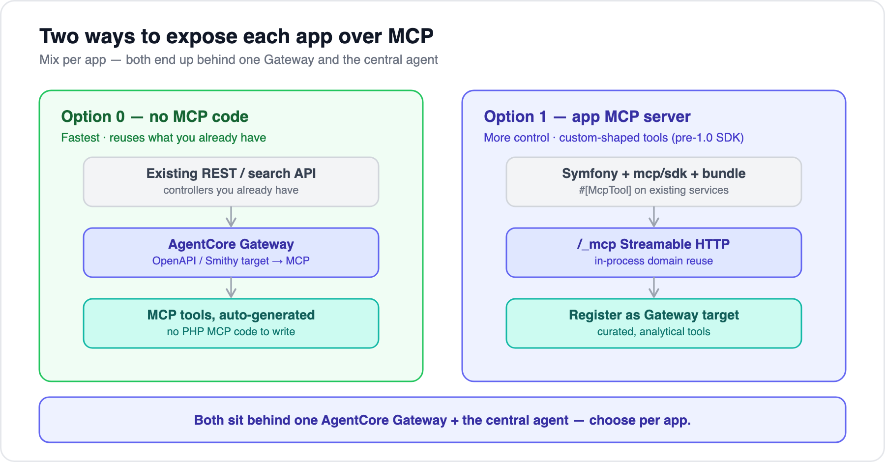

# 03 — Exposing apps as MCP

[← 02 Data access](02-data-access-options.md) · [Index](../README.md) · Next: [04 — Query routing](04-query-routing-options.md)

---

**MCP (Model Context Protocol)** is the standard contract for exposing data/tools to an agent. Each app becomes an MCP **server** (advertising tools, resources, prompts); the central agent is the MCP **client**. This turns "connect N apps to the service" into one repeatable pattern instead of N bespoke integrations.

## Two ways to expose an app — and you can mix



### Option 0 — no MCP code (fastest)
**Amazon Bedrock AgentCore Gateway** can take an app's **OpenAPI or Smithy spec (or a Lambda)** as a *target* and auto-generate MCP tools from it. So for an app whose existing REST/search API already covers the data, you write **zero MCP code** — point Gateway at the spec and you're done.

- **Best when:** the existing API already answers the questions.
- **Trade-off:** tool shapes mirror your endpoints; less control over how the LLM sees them.

### Option 1 — an MCP server in the app (more control)
Embed an MCP server in the Symfony app for **custom-shaped analytical tools** and in-process reuse of your domain layer.

- **Best when:** you want carefully-described tools tuned for the LLM, or aggregations your REST API doesn't expose.
- **Trade-off:** it's pre-1.0 code (below) — pin versions.

> Most teams **mix**: Option 0 to bring apps online quickly, Option 1 for the app where tool quality matters. Both sit behind the same Gateway and the same agent.

## The PHP / Symfony MCP server (Option 1)

The PHP ecosystem consolidated in late 2025 around an **official SDK, `mcp/sdk`** (`github.com/modelcontextprotocol/php-sdk`), maintained jointly by the Symfony project, The PHP Foundation, and Anthropic's MCP team. Important: it is **experimental / pre-1.0** (latest `v0.6.0`, 2026-06-02, no backward-compat promise), and PHP is a **Tier-3** SDK (Tier-1 = TS, Python, C#, Go). It works — pin exact versions and expect churn. The Symfony-native wrapper is **`symfony/mcp-bundle`** (~`v0.10`, also experimental), giving autowiring, attribute discovery, and an HTTP-transport controller at `/_mcp`.

```bash
composer require mcp/sdk symfony/mcp-bundle   # pin exact versions; both pre-1.0
```

```yaml
# config/packages/mcp.yaml
mcp:
  app: 'orders-api'
  version: '1.0.0'
  client_transports: { stdio: true, http: true }
  http:
    path: /_mcp
    session: { store: file, directory: '%kernel.cache_dir%/mcp-sessions', ttl: 3600 }
```

```php
use Mcp\Capability\Attribute\McpTool;   // namespace verified

final class OrderTools
{
    public function __construct(
        private OrderRepository $orders,
        private TenantContext $tenant,        // resolved from the OAuth token, NOT from args
    ) {}

    #[McpTool(name: 'search_orders')]
    public function searchOrders(string $query, string $status = 'any', int $limit = 25): array
    {
        // reuse the EXISTING repository — no raw SQL, tenant injected server-side
        $rows = $this->orders->search($query, $status, min($limit, 100), tenant: $this->tenant->id());
        return ['items' => array_map(fn($o) => $o->toSummary(), $rows), 'next_cursor' => null];
    }
}
```

**Runtime:** run the MCP container under **FrankenPHP worker mode or RoadRunner** for a warm kernel and real streaming (~3–4× php-fpm in Symfony benchmarks; the gain shrinks when the DB is the bottleneck, which is common here). Plain **php-fpm works for a first cut** in stateless JSON mode but won't stream.

**Alternative:** for a non-PHP app, or to avoid any long-running PHP process, run a small **Node/Python MCP sidecar** in front of the app's internal API instead of embedding in PHP.

## Tool & resource design (verified against the `2025-11-25` spec)

Aim for **8–15 verb-named tools per app** that wrap existing repository/search methods — not one-tool-per-table.

- `inputSchema` / optional `outputSchema` are **JSON Schema 2020-12**. Use enums for status/sort, opaque string cursors for pagination, `{from,to}` for dates, and a precise `description` on every property — that's what makes the LLM pick and fill them correctly.
- Return **both** a serialized-JSON `TextContent` block **and** `structuredContent`. Under `2025-11-25`, **`structuredContent` must be a JSON object** — wrap arrays as `{items:[…], next_cursor:…}`. Set `annotations.readOnlyHint: true`.
- **Errors:** use `isError: true` with an actionable message for recoverable validation/business errors (the model self-corrects); reserve JSON-RPC errors (`-32602`) for unknown-tool/malformed-request. ⚠️ Known SDK gotcha: when `outputSchema` is declared, some SDKs validate `structuredContent` *before* honoring `isError` and can mask your error — on error paths, omit non-conforming `structuredContent`.
- **Never accept `tenant_id` as an argument.** Resolve tenant from the OAuth token claim and enable a **Doctrine SQL filter** per request, so every query is automatically scoped — the model can't choose a tenant.
- Publish a **semantic catalog as MCP resources** (`resources/list` + URI templates): view/column descriptions, enum glossaries, example-question → tool mappings. Load it as context so routing and SQL generation are grounded.
- **Expose entities and set lists as resources** for the interop use case — `appA://customer/123` (a page's entity), `appA://lists/categories` (a list that can fill a field in another app). The *same* capability serves the agent (MCP tool/resource) and other apps directly (REST / MCP client). See [doc 09](09-interop-and-entity-resolution.md).

```json
{
  "name": "search_invoices",
  "title": "Search Invoices",
  "description": "Search invoices for the authenticated account. Tenant is taken from the connection; do not pass an account id.",
  "inputSchema": {
    "type": "object",
    "properties": {
      "query":  {"type":"string","description":"Free-text match on number, customer, or reference."},
      "status": {"type":"string","enum":["draft","sent","paid","overdue","void"]},
      "date_range": {"type":"object","properties":{"from":{"type":"string","format":"date"},"to":{"type":"string","format":"date"}}},
      "sort_by":  {"type":"string","enum":["issue_date","due_date","amount"],"default":"issue_date"},
      "cursor":   {"type":"string","description":"Opaque cursor from a previous result; omit for first page."},
      "limit":    {"type":"integer","minimum":1,"maximum":100,"default":25}
    },
    "additionalProperties": false
  },
  "outputSchema": {"type":"object","properties":{"items":{"type":"array"},"total":{"type":"integer"},"next_cursor":{"type":["string","null"]}},"required":["items","next_cursor"]},
  "annotations": {"readOnlyHint": true}
}
```

---

Next: [04 — Query routing options](04-query-routing-options.md)
