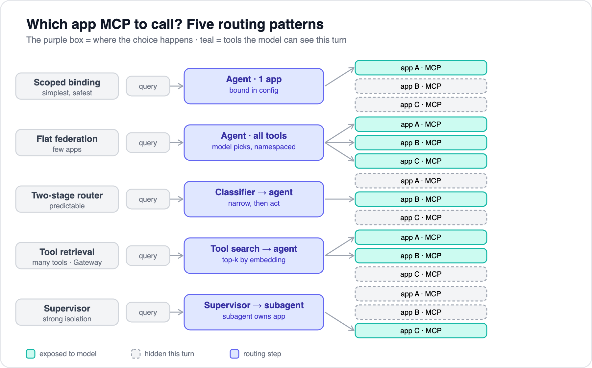
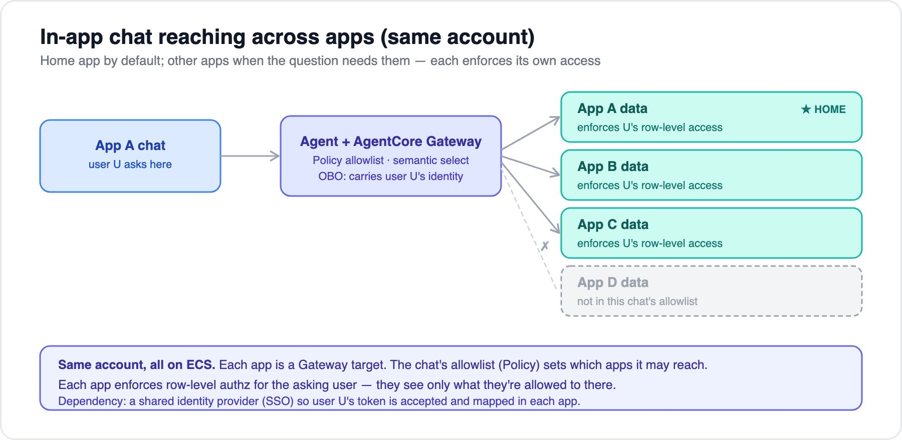

# 04 — Query routing options

[← 03 Exposing apps as MCP](03-exposing-apps-as-mcp.md) · [Index](../README.md) · Next: [05 — AWS deployment & security](05-aws-deployment-and-security.md)

---

Once several apps are exposed over MCP, the agent has to decide **which app's data answers this question**. The key mental model: the agent never sees apps or databases — it sees a **toolbox**, and routing *is* tool selection. So routing quality is mostly a function of how well you **name and describe** each tool and server.

## Five patterns



The only thing that changes across the patterns is the **purple box — where the narrowing happens** — and how many tools the model can see.

| Pattern | Narrowing happens… | Use when |
|---|---|---|
| **Scoped binding** | at config time (no NL routing) | Chat lives inside one app, asks that app's data. Simplest, safest. |
| **Flat federation** | not at all — all allowed tools exposed, namespaced (`billing.*`) | 2–5 apps, modest tool count. |
| **Two-stage router** | a cheap classifier *before* the main agent | Many apps, or you want predictable/cheap routing. |
| **Tool retrieval** | embedding similarity picks top-k tools | Hundreds of tools, or you want it managed (Gateway does this). |
| **Supervisor + subagents** | delegation to a per-app subagent | Hard isolation or per-app reasoning differs. |

> These **compose**. The common production shape is *router → flat federation within the chosen domain*: classify to an app (or a small set), then let the model pick freely among just that app's tools. **AgentCore Gateway** gives you the tool-retrieval row as managed infrastructure (semantic tool search over aggregated targets).

## Our case — cross-app tool bundles per feature

Our chat features aren't single-app: a chat inside App A must reach **App A's data plus an allowlisted set of other apps** (all internal apps on ECS in the same account). So these features land on **flat federation or a two-stage router over a per-feature allowlist** — *not* scoped binding. Each feature gets a **tool bundle**:

```
bundle(App A chat) = App A tools (home / default) + allowlisted other-app tools
```



- **Allowlist (feature level):** AgentCore **Policy** defines which apps App A's chat may reach — the candidate set, separate from relevance-based routing.
- **Identity (user level):** default is **per-user** — the agent carries the asking user's identity via **OBO** and each app enforces its own row-level authz. For cross-app data the user *can't* directly access, a **governed feature/role policy** decides what may be shown (read via a read-only service credential, with redaction). Full model in [doc 08](08-authorization-and-read-only.md).
- **Home app as default:** bias the agent toward the home app's tools and reach out to others only when the question needs it — this keeps the visible toolbox small and answers fast.
- **Dependency:** a shared identity provider (SSO) so the user's token is accepted and mapped in each app. If user stores are separate, add an identity-mapping step. See [doc 05](05-aws-deployment-and-security.md#authentication--authorization).

## Four rules that keep routing safe and sane

1. **Routing respects authorization, not just relevance.** Relevance picks the tool; a hard **allowlist** picks the candidate set. The model only ever chooses among servers/tools this user + feature are already permitted to touch (AgentCore **Policy**, GA 2026-03-03, does this as managed infra).
2. **Cross-app questions need multi-server reach.** "Compare overdue invoices with active accounts" requires an agent that can call two servers and synthesize — flat federation, tool retrieval, or supervisor handle it; strict scoped-binding doesn't.
3. **Ambiguity → ask, don't guess.** When a question could match multiple apps, the agent should ask a clarifying question rather than silently route to one.
4. **Tool-count is the silent killer.** Loading every tool from every app degrades selection accuracy and burns tokens — that's the whole reason the router/retrieval patterns exist. Keep the model's visible toolbox small per request.

## How the central agent consumes it (Bedrock)

Two viable paths; they compose well.

**Path A — managed (recommended default):** register each app (OpenAPI/Smithy/Lambda/MCP) as an **AgentCore Gateway target**; the agent connects to the **single Gateway MCP endpoint**. You get federation, `target___tool` namespacing (exactly **three** underscores), **built-in semantic tool selection**, OAuth, and on-behalf-of identity in one surface. Gateway accepts MCP versions `2025-06-18` / `2025-03-26` / `2025-11-25`.

**Path B — custom loop (more control):** use the **Strands Agents SDK** — one `MCPClient` per app over Streamable HTTP, with Python-only `prefix=` and `tool_filters` for namespacing/scoping (TypeScript lacks these yet):

```python
from strands import Agent
from strands.tools.mcp import MCPClient
from mcp.client.streamable_http import streamablehttp_client
import re

orders  = MCPClient(lambda: streamablehttp_client("https://orders/_mcp"),
                    prefix="orders", tool_filters={"allowed": [re.compile(r"^search_.*")]})
billing = MCPClient(lambda: streamablehttp_client("https://billing/_mcp"), prefix="billing")
agent = Agent(tools=[orders, billing])      # Strands runs the MCP→Converse tool_use bridge
```

Or do the bridge yourself — MCP `inputSchema` is JSON Schema and drops straight into Converse:

```python
toolConfig = {"tools": [{"toolSpec": {
    "name": t.name, "description": t.description,
    "inputSchema": {"json": t.inputSchema}}} for t in tools]}

resp = bedrock_runtime.converse(modelId=..., messages=msgs, toolConfig=toolConfig)
if resp["stopReason"] == "tool_use":
    for b in resp["output"]["message"]["content"]:
        if "toolUse" in b:
            tu = b["toolUse"]
            out = await session.call_tool(tu["name"], tu["input"])   # call the MCP server
            msgs.append({"role":"user","content":[{"toolResult":{
                "toolUseId": tu["toolUseId"], "content":[{"text": out}]}}]})
    # re-call converse with the appended toolResult
```

> Avoid **legacy Bedrock Agents** (pre-AgentCore) — they only reach MCP via a Lambda action-group shim. Use AgentCore.

---

Next: [05 — AWS deployment & security](05-aws-deployment-and-security.md)
