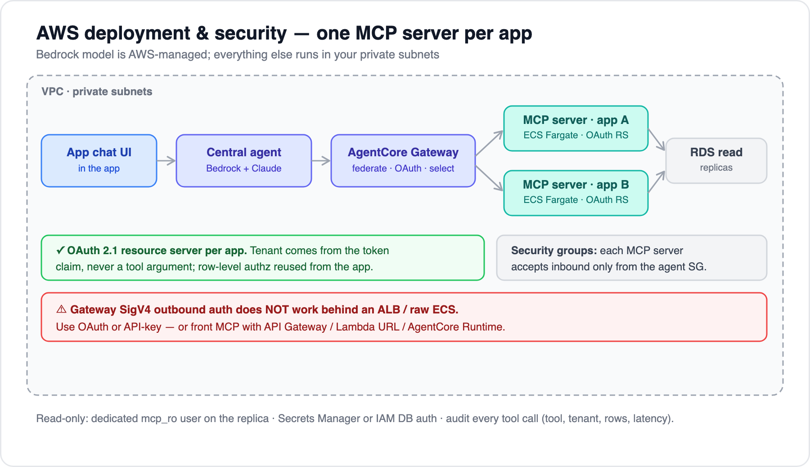

# 05 — AWS deployment & security

[← 04 Query routing](04-query-routing-options.md) · [Index](../README.md) · Next: [06 — Recommendation & plan](06-recommendation-and-plan.md)

---

This is the part that decides whether the system ships. Treat it as the feature, not an afterthought.

## Topology

- **One MCP server per app**, each as its own **ECS/Fargate service** in **private subnets** (not a sidecar — independent scaling and IAM). Use **ECS Service Connect** (Cloud Map) for name-based discovery.
- Scope each MCP server's **security group** to accept inbound **only** from the central agent's SG. VPC-only networking is the floor, not the authz control.
- Use **stateless Streamable HTTP** so you can scale replicas without session affinity.

## Authentication & authorization

- Make each MCP server an **OAuth 2.1 Resource Server**: validate JWT signature + **audience bound to that one server** (RFC 8707 resource indicators, RFC 9728 protected-resource metadata), require scopes, and derive **tenant/user from the token claims**. Reject tokens with a missing/wrong `aud` to prevent the confused-deputy problem.
- The MCP authorization spec **requires OAuth 2.1 + PKCE and forbids token passthrough** — which is exactly how you carry tenant identity safely across hops.
- **Propagate end-user identity end-to-end** with Gateway **on-behalf-of (OBO) token exchange**, and enforce row-level authz inside each app's existing repository/voter layer — don't re-implement it in the tool. This is exactly how a chat in one app safely reads **another** app's data: the *other* app authorizes the **asking user** (not the agent), so they see only what they're permitted to there. It depends on a **shared identity provider (SSO)** across the apps — if user stores are separate, add an identity-mapping step.
- **Hard-allowlist tools** with AgentCore **Policy** (GA 2026-03-03): which agent/feature may call which tools, independent of what the model finds relevant.

> The full cross-app visibility model (per-user default + governed fallback) and the read-only invariant live in **[doc 08 — Authorization & read-only](08-authorization-and-read-only.md)**.

## ⚠️ The gotcha that quietly breaks deployments

> **AgentCore Gateway's IAM/SigV4 _outbound_ auth does NOT work behind an ALB or raw ECS/EC2** — only API Gateway, Lambda Function URLs, or AgentCore Runtime verify SigV4.

So if you front your MCP servers with an **internal ALB, you must use OAuth (or API-key) outbound auth**, not SigV4. If you want SigV4, front MCP with private API Gateway / Lambda Function URLs instead. Gateway reaches private in-VPC servers via a managed VPC resource / VPC Lattice `privateEndpoint` (`vpcIdentifier`, `subnetIds`, `securityGroupIds`).

## Data access hardening

- For any SQL path: a dedicated **read-only DB user** (`GRANT SELECT` on specific **views**) on a **read replica**, on a network path with no writer access.
- Credentials in **Secrets Manager** (with rotation) or **RDS IAM DB auth** (`rds-db:connect`), scoped per app. Note: for **PostgreSQL you can't IAM-auth a hot-standby replica** the same way as the writer — verify per engine. Keep new IAM-auth connections under ~200/sec (soft guidance).
- Give each MCP ECS task a **tightly-scoped IAM task role** (only its own secret/DB-user ARN) so a compromised server can't reach another app's data.

## Observability & guardrails

- **Audit every tool call**: tool, tenant, redacted args, row count, latency → CloudWatch + an immutable store. This is both your compliance story and your debugging story.
- Per-tenant **rate limits**, result-size/timeout **cost guards**, and a per-tool/per-server **kill switch** (feature flag).
- Cheap `/health` endpoint (no per-probe DB hit) for ALB/ECS health checks; tune graceful shutdown for streaming PHP workers.
- Add **Bedrock Guardrails** for PII redaction and prompt-injection mitigation — retrieved data can contain injected instructions.

## Discovery / registration

- **A few apps:** static config (SSM).
- **Many apps / central governance:** **AgentCore Gateway** as the registry — targets + a unified `tools/list` catalog, semantic tool search, and OBO credential brokering. Refresh the catalog with `SynchronizeGatewayTargets` after changing tools.

---

Next: [06 — Recommendation & rollout plan](06-recommendation-and-plan.md)
