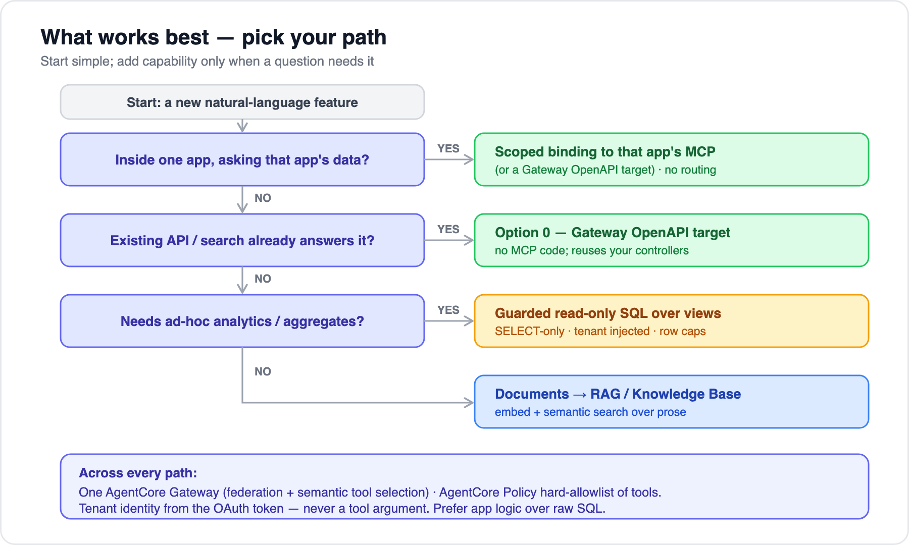

# 06 — Recommendation & rollout plan

[← 05 AWS deployment & security](05-aws-deployment-and-security.md) · [Index](../README.md) · Next: [07 — Orchestration options](07-orchestration-options.md)

---

## What works best

Start with the simplest thing that answers the question, and add capability only when a question needs it.

## Recommended stack

| Layer | Choice | Why |
|---|---|---|
| Per-app data exposure | **Gateway OpenAPI target** first; PHP MCP server where you want custom tools | Fastest path reuses existing APIs; bespoke server only where it pays off |
| Transport | Streamable HTTP, spec `2025-11-25` (pinned) | Current stable; stateless scaling |
| Fan-in / routing | **AgentCore Gateway** | Federation + semantic tool selection + OBO in one surface |
| Central agent | **Hybrid** — AgentCore Gateway + Identity + Policy + a thin owned orchestration/audit layer | Managed plumbing, security-critical logic stays yours ([doc 07](07-orchestration-options.md)) |
| AuthZ | Per-user OBO by default + **governed feature/role policy** for cross-app reads + Doctrine tenant filter | Reuses app authz where possible; governs the rest centrally ([doc 08](08-authorization-and-read-only.md)) |
| Read-only | **Six-layer invariant** — replica, SELECT-only grants, no write tools, SQL validator, IAM, guardrails | Mutation impossible by construction ([doc 08](08-authorization-and-read-only.md)) |
| Data | Read replica + `mcp_ro` over curated views; app repositories/OpenSearch preferred | Read-only, least privilege, reuse tuned search |

## Phased rollout

1. **Pilot — one app, API-first.** Stand up the query-er service + north API. Expose one app via **Option 0** (Gateway OpenAPI target) or a few repository-backed tools. Prove the loop, auth, tenant scoping, and audit end-to-end. No raw SQL yet.
2. **Add guarded NL→SQL for that app.** Read replica + read-only user + curated views + the SQL validator and injected tenant predicate. Build the semantic catalog (table/column descriptions, example questions) — this is the unglamorous work that determines answer quality.
3. **Add RAG** if the app has document/prose data worth searching.
4. **Onboard app #2 and the non-Symfony app, and turn on cross-app bundles.** Register each app as a Gateway target; define each chat feature's **allowlist** (which apps it may reach) and wire **OBO** so cross-app reads run as the asking user. Standardize the contract so onboarding is a checklist, not a project.
5. **Optional federation.** A router/supervisor that spans apps — only once per-app scoping and audit are proven.

## Decisions the team needs to make

| Decision | Why it matters |
|---|---|
| Structured (counts/aggregates) vs. document/text questions? | Sets the API-vs-SQL-vs-RAG mix ([doc 02](02-data-access-options.md)) |
| Are the apps multi-tenant? | If yes, API-first is *strongly* preferred — apps already enforce row isolation |
| DB engine(s) — Aurora/RDS Postgres vs MySQL? | Changes view/validator details and whether pgvector is viable for RAG |
| Do the apps share an identity provider (SSO)? | **Per-user cross-app reads (OBO) depend on it.** Separate user stores need an identity-mapping step |
| How are the same entities keyed across apps? | Mixed today — build an incremental **entity-resolution / ID-map** per entity type ([doc 09](09-interop-and-entity-resolution.md)) |
| Which apps may each chat feature reach? | Defines the per-feature allowlist (AgentCore Policy) — the cross-app tool bundle |
| Orchestration: AgentCore vs. custom vs. hybrid? | Full write-ups + pros/cons in [doc 07](07-orchestration-options.md); recommended **hybrid** |
| Which app to pilot first? | Pick one with a clean existing API and clear demand |

## Risks & things to watch

- **Pre-1.0 churn:** `mcp/sdk` and `symfony/mcp-bundle` are **experimental** — pin exact versions and budget for breaking changes. The `2026-07-28` MCP revision is **RC, not GA** — don't build on its changes yet.
- **The SigV4-behind-ALB incompatibility** ([doc 05](05-aws-deployment-and-security.md)) is the deployment-time surprise — decide your outbound auth (OAuth/API-key) up front.
- **Tenant leakage via NL→SQL** is the highest-severity failure mode — which is why API/search is the default and the SQL tool is tightly fenced.
- **Tool-count bloat** degrades routing — lean on Gateway semantic selection and per-feature allowlists.
- **Shared identity is a prerequisite** for per-user cross-app reads — confirm SSO across the apps early, or budget for an identity-mapping step.

## Suggested next step

Pick the pilot app, its DB engine, and whether it's multi-tenant. From that we can scaffold a starter: the query-er service skeleton (north API + Bedrock tool-use loop + SQL validator), one app exposed via a Gateway OpenAPI target *or* a Symfony MCP server with the tenant filter, and a Terraform/CDK sketch of the ECS service + Gateway target + OAuth resource-server config.

---

[← Back to index](../README.md)
