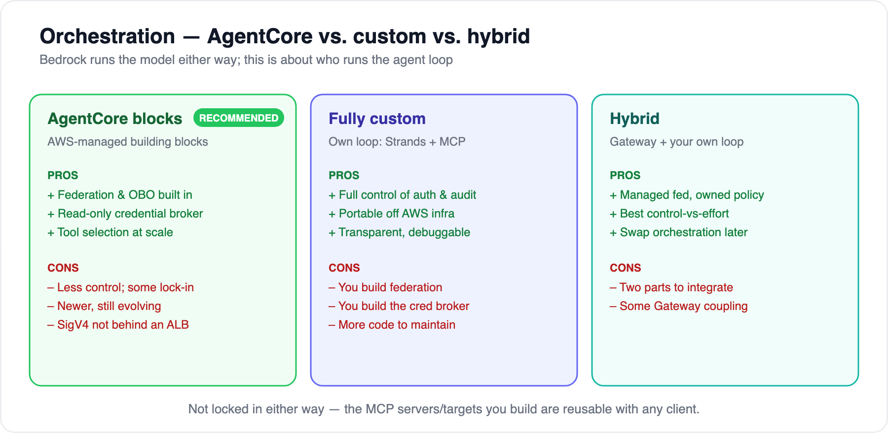

# 07 — Orchestration: AgentCore vs. custom

[← 06 Recommendation](06-recommendation-and-plan.md) · [Index](../README.md) · Related: [08 — Authorization & read-only](08-authorization-and-read-only.md)

---

Bedrock runs the **model** either way. This doc is about who runs the **agent loop** — the part that federates the app tools, selects which to expose, brokers identity/credentials, and audits every call. There are three shapes.



## Option A — AgentCore building blocks

**What it is:** lean on AWS-managed AgentCore primitives and write only a thin layer on top.

| Piece | Does |
|---|---|
| **Gateway** | Federates N MCP/OpenAPI/Lambda targets behind one endpoint; semantic tool selection; `target___tool` namespacing |
| **Identity** | OBO token exchange + outbound **credential brokering** — including a **scoped read-only service credential** per store |
| **Policy** (GA 2026-03-03) | Deterministic per-tool allowlists |
| **Runtime** | Isolated, stateful sessions (microVM) |

**Pros**
- Federation, OBO, and per-tool allowlists **out of the box** — you don't build them.
- The **read-only credential broker** directly serves "the agent has its own read-only access to other stores."
- **Semantic tool selection** scales past tool-count limits as apps multiply.
- Integrated with IAM, CloudWatch, Secrets Manager; GA since 2025-10-13.

**Cons**
- Less control over the loop; a managed flow is **harder to debug**.
- Some **AWS lock-in** at the orchestration layer.
- **Newer service**, still evolving — pin behaviors and watch release notes.
- The **SigV4-behind-ALB** constraint (see [doc 05](05-aws-deployment-and-security.md)).

**Best when:** you want to ship fast, AWS-native is fine, and the built-in OBO + credential broker + Policy are worth the reduced control.

## Option B — Fully custom (Strands + MCP + Converse)

**What it is:** you own the agent loop end to end — **Strands Agents** (AWS's open-source SDK) or LangGraph + the official **MCP client** (one per app, Streamable HTTP) + **Bedrock Converse** for the model. You implement federation, tool scoping, identity brokering, and audit yourself.

```python
from strands import Agent
from strands.tools.mcp import MCPClient
from mcp.client.streamable_http import streamablehttp_client
import re

orders  = MCPClient(lambda: streamablehttp_client("https://orders/_mcp"),
                    prefix="orders", tool_filters={"allowed": [re.compile(r"^search_.*")]})
billing = MCPClient(lambda: streamablehttp_client("https://billing/_mcp"), prefix="billing")
agent = Agent(tools=[orders, billing])   # you own the loop, the audit, the read-only checks
```

**Pros**
- **Full control of the security-critical path** — auth, read-only enforcement, governed-visibility policy, redaction, audit all live in your code (matters a lot given your requirements).
- **Portable** off AWS-managed agent infra.
- **Transparent and debuggable**; no Gateway-specific constraints.

**Cons**
- You **build federation and semantic selection** (or go without).
- You **build the credential broker / OBO exchange**.
- **More code to own** and keep current; you own scaling and session isolation.

**Best when:** control and portability matter more than time-to-first-demo, and you want every line of the auth logic in your repo.

## Option C — Hybrid (the sweet spot for your constraints)

**What it is:** AgentCore **Gateway** as the MCP federation point + **read-only credential broker** (and optionally Policy), but your **own agent loop** runs the governed-visibility policy, redaction, and audit.

**Pros**
- **Managed plumbing, owned decisions** — federation/credentials handled for you; the security-critical logic stays yours.
- **Best control-vs-effort** balance.
- You can **swap orchestration later** without rebuilding the app MCP servers.

**Cons**
- **Two moving parts** to integrate.
- Still some **Gateway coupling**.

**Best when:** you want managed infrastructure but the read-only + governed-visibility decisions in code you control — which is exactly your situation.

## Side by side

| Dimension | A · AgentCore | B · Fully custom | C · Hybrid |
|---|---|---|---|
| Federation / tool selection | ✅ managed | 🔨 you build | ✅ managed |
| OBO + read-only cred broker | ✅ managed | 🔨 you build | ✅ managed |
| Per-tool allowlist (Policy) | ✅ managed | 🔨 you build | ✅/🔨 either |
| Auth/audit/read-only logic | ⚠️ partly managed | ✅ fully yours | ✅ fully yours |
| Portability | ⚠️ AWS-coupled | ✅ high | 🟨 medium |
| Time to first demo | ✅ fastest | ⚠️ slowest | 🟨 medium |
| Lock-in | ⚠️ higher | ✅ low | 🟨 medium |

## Recommendation

Your requirements — **strict read-only**, **governed cross-app visibility**, **strong audit** — argue for keeping the security-critical logic in code you own while letting AWS handle the undifferentiated plumbing. That points to **Hybrid** (or Option A with a thin owned layer), not either extreme. Concretely: start with **AgentCore Gateway + Identity + Policy**, and keep **orchestration, the governed-visibility policy, redaction, and audit yours**. If lock-in ever bites, the same **MCP servers drop into a fully custom Strands loop unchanged** — they're the durable asset.

---

Next: [08 — Authorization & read-only](08-authorization-and-read-only.md)
