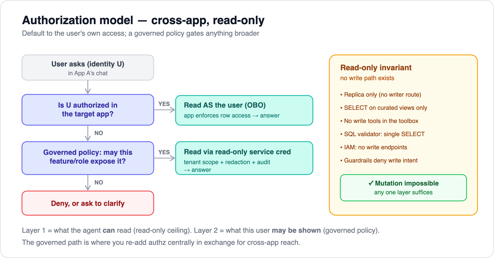

# 08 — Authorization model & the read-only invariant

[← 07 Orchestration](07-orchestration-options.md) · [Index](../README.md) · Related: [05 — AWS deployment & security](05-aws-deployment-and-security.md)

---

The cross-app requirement: a user in App A may need answers drawn from App B **even if they have no App B account**, and the agent must **never mutate anything**. This is the model we chose to make that safe.

## Decouple two questions

The key move is to separate **what the agent _can_ read** from **what this user _may be shown_**.

| Layer | Question | Mechanism |
|---|---|---|
| **1 — Store access (ceiling)** | What may the *agent* read? | A scoped **read-only service credential** per store (AgentCore Identity-brokered or a secret), pointed at **read replicas / curated views** |
| **2 — User visibility (governed)** | What may *this user, in this chat* be shown? | A **governed feature/role policy** + tenant scoping + field redaction at the view/tool layer |

## The decision flow

1. **Is the user authorized in the target app?**
   - **Yes →** read **as the user** (OBO); the app enforces its own row-level access. *Preferred* — it reuses the app's authz and adds no new exposure.
   - **No →** consult the governed policy.
2. **Governed feature/role policy: may this chat feature / this user's role expose this data?**
   - **Yes →** read via the **read-only service credential**, then apply **tenant scoping + field redaction + full audit** at the curated-view/tool layer.
   - **No →** deny, or ask the user to clarify.

So per-user OBO is the default; the broad service-read path is the **governed fallback** for cross-app data the user can't directly access.

## What "governed feature/role policy" means concretely

- A **central, declarative, version-controlled** policy mapping `{chat feature, user role} → {apps / views / fields exposable}`. Implement with **AgentCore Policy** for the per-tool allowlist plus your own rules for field/row exposure.
- **Curated views per exposure level** — define what each level may see; redact sensitive columns there, not in the prompt.
- Because you've **decoupled store-access from user-visibility, you've taken authz on centrally** — so this policy must be reviewed and changed like any other access-control change, with the same rigor.
- **Audit every cross-app read:** who asked, which feature/role, which view, row count, redactions applied, `audit_id` returned to the caller.

> **Why not just "let the agent read everything"?** The moment the agent can read what the user can't, the chat becomes a path to data they otherwise couldn't see. The governed policy is exactly what keeps that **controlled** rather than an uncontrolled leak. It's a deliberate trade: cross-app reach in exchange for owning the authorization centrally.

## The read-only invariant — a hard guarantee

No mutation, ever. Enforced **independently at six layers** (defense in depth) — any one is sufficient, so a gap in one doesn't create a write path:

1. **Replica only** — agent reaches RDS **read replicas**; no network route to the writer.
2. **DB grants** — the `mcp_ro` user has **only `SELECT`** on curated **views**; no INSERT/UPDATE/DELETE/DDL grant exists.
3. **No write tools** — MCP servers expose only query tools; there is no mutation tool in the toolbox.
4. **SQL validator** — any raw-SQL tool rejects anything but a single `SELECT`.
5. **IAM** — task roles can't reach write endpoints; Gateway targets are read-only.
6. **Guardrails / Policy** — deny write intent as a backstop.

**Make it a tested invariant:** add a CI check that the `mcp_ro` grants are SELECT-only and that no tool definition carries write semantics. Treat a violation as a build failure, not a review comment.

## Identity dependency

Per-user OBO needs a **shared identity provider (SSO)** so the user's token is accepted and mapped in each app. If the apps have separate user stores, add an **identity-mapping** step. See [doc 05 → Authentication & authorization](05-aws-deployment-and-security.md#authentication--authorization).

---

[← Back to index](../README.md)
