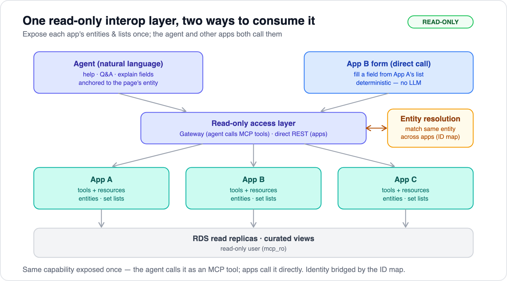

# 09 — Interop layer & entity resolution

[← 08 Authorization & read-only](08-authorization-and-read-only.md) · [Index](../README.md)

---

The deeper goal isn't only a chat box — it's to **connect apps that are conceptually interconnected but not technically tied together**, so entities and lists can flow between them. The agent is **one consumer** of that shared layer; the apps themselves are another. Everything stays **read-only**.

## One exposure, two consumers

Expose each app's **entities and lists once**, read-only, then let two kinds of caller use them:

| Consumer | Calls it as | For |
|---|---|---|
| **The agent** | an MCP **tool/resource** | in-context help, Q&A, explaining fields, reasoning across entities |
| **Another app** | a **direct call** (REST, or as an MCP client) | populating a form field from another app's list — deterministic, no LLM |

Same capability underneath — you build it once. AgentCore Gateway's **OpenAPI target** gives you both paths from one implementation: the REST endpoint App B calls directly *also* becomes the MCP tool the agent calls.

## "Both, by case" — when to use which

You said field population would be both, depending on the case. The rule of thumb:

- **Direct call** — fixed/known lists: controlled vocabularies, status enums, category pick-lists, reference data. Fast, cheap, exact, can't hallucinate an option.
- **Through the agent** — when the field needs **judgment**: NL-driven filtering ("show contracts similar to this one"), or it's part of a conversation. The agent makes the same tool call, just with reasoning around it.
- **Heuristic:** if the list is deterministic from its inputs, call it directly; if it needs interpretation, let the agent call the tool.

## Modeling it in MCP

- **Resources** for *addressable* data — `appA://customer/123` (the page's entity), `appA://lists/product-categories` (a set list). Cacheable and described; this is the natural fit for "a page's entity" and "a set list."
- **Tools** for queries/actions — `search_customers`, `get_order`, `list_categories`.
- **Semantic catalog** (field/column descriptions) powers "explain this field" *and* validates values used for field population.

This is a good reason to do real MCP **servers** ([Option 1, doc 03](03-exposing-apps-as-mcp.md)) for the apps that anchor entities — resources are first-class there.

## Entity resolution — the one genuinely new work-stream

Identity across the apps is **mixed** (some shared keys, some not). For the agent — or App B — to act on *"the same customer"* the user is viewing in App A, you need a small **entity-resolution / ID-map**. Build it incrementally:

1. **Audit** — list the shared entity types (customer, product, …) and how each is keyed in each app today.
2. **Canonical IDs** — pick or mint a canonical id per entity type; keep a cross-reference (xref) map: `appA_id ↔ canonical ↔ appB_id`.
3. **Resolution order** — (a) shared key if it exists; (b) deterministic natural-key match (email, SKU, tax id); (c) explicit mapping table; (d) else *unresolved* → the agent surfaces the ambiguity rather than guessing.
4. **Scope by priority** — build per entity type, starting with **whatever your pilot page is about**. Don't boil the ocean.

The xref map is **reference data you maintain/sync out of band** — it's read by the agent and apps, never written by the agent, so the [read-only invariant](08-authorization-and-read-only.md#the-read-only-invariant--a-hard-guarantee) still holds.

## Where it lands in the build

- **Phase 1 (pilot):** expose the pilot app's anchor **entity** + its key **lists**; the agent uses them in-context.
- **Phase 1.5:** wire one direct field-population path — App A list → App B field.
- **Phase 2:** stand up the xref map for the pilot entity; expand per entity type as cross-app needs appear.

---

[← Back to index](../README.md)
