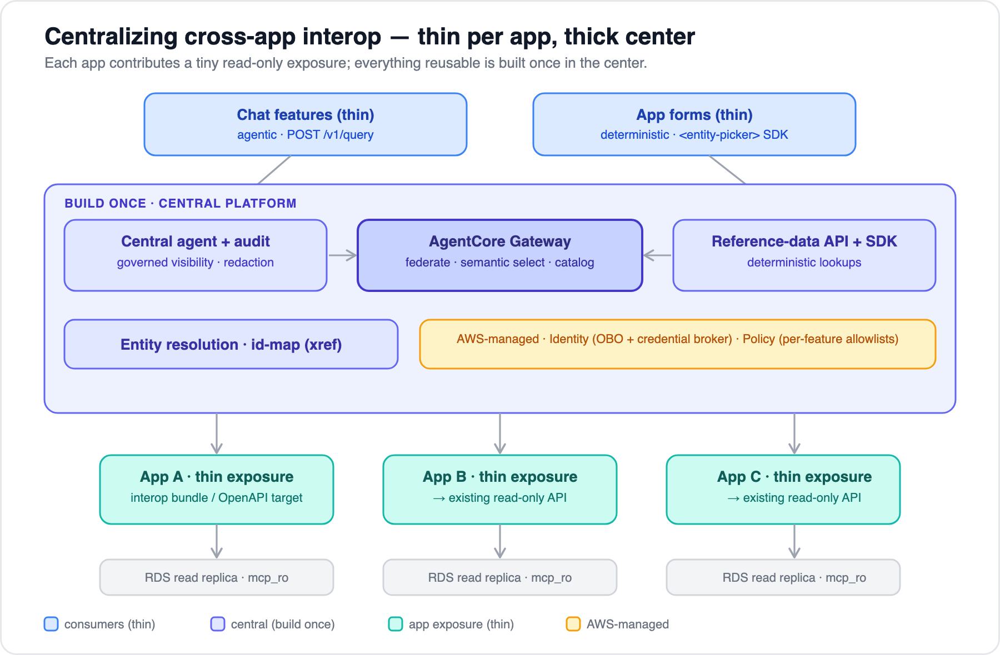

# 11 — Centralizing cross-app interop (many apps, no duplication)

[← 10 From the demo to AWS](10-from-demo-to-aws.md) · [Index](../README.md)

---

**Question:** with N apps linking to each other both deterministically (App B's field from App A's
list) and non-deterministically (an agent answering across apps), how do we centralize this so we're
not copy-pasting the same plumbing into every app?

**Answer in one line:** *thin per app, thick center.* Each app contributes a tiny read-only
**exposure**; everything reusable — federation, the agent, auth, audit, entity resolution — is built
**once** in the center. Both the deterministic and the agentic link reuse the *same* exposure
("one exposure, two consumers" from [doc 09](09-interop-and-entity-resolution.md), scaled to N apps).

## The duplication you're avoiding

In the demo, every integration is hand-coded: the MCP server hand-writes the fetchers + tool/resource
defs + data dictionary, the React app hand-builds the constrained picker, App B hand-validates the
canonical id. With N apps that's **N copies** of: per-app fetchers, tool/resource definitions, the
data dictionary, the dropdown UI, the "reject free text" rule, auth, read-only enforcement,
pagination, audit — and, worst of all, an embedded agent per chat feature. Centralizing means each of
those lives in exactly one place.

## Where each concern lives

| Concern | Lives in | Why there |
|---|---|---|
| App's data + its native (row-level/tenant) authz | **per app** | data locality; reuse the app's existing authorization |
| Exposure of entities / lists / tools / resources | **shared library** (a Symfony "interop bundle") *or* **AWS-managed** (a Gateway OpenAPI target) | one pattern, not per-app code |
| The "must be a canonical value" rule (the 422) | **per app** (declared, enforced by the bundle) | it's app-local business logic — *don't* centralize it |
| Deterministic dropdown / entity fetch UI | **shared library** (frontend SDK) | one `<entity-picker>` / `usePicker(type)` for every form |
| Federation, routing, tool catalog | **AWS-managed** (AgentCore Gateway) | one endpoint, semantic selection, `target___tool` namespacing |
| The agent loop | **central service** | one agent, never embedded per app |
| Governed visibility, redaction, audit | **central service** | the cross-app authz you took on ([doc 08](08-authorization-and-read-only.md)) |
| OBO + outbound credential brokering | **AWS-managed** (AgentCore Identity) | one identity layer for all targets |
| Per-feature / per-tool allowlists | **AWS-managed** (AgentCore Policy) | central, declarative, model-independent |
| Entity resolution (id-map across apps) | **central service** | can't belong to any single app |

The split *is* the design: the only thing that varies per app is a small declarative exposure;
everything reusable is centralized.

## Centralizing the **deterministic** links

App B's form should not hand-write a fetch to App A. Instead:

1. **App A** declares its entities/lists once (in the interop bundle, or by registering its existing
   `/api/phones` as a **Gateway OpenAPI target** — zero MCP code). That one declaration produces the
   read-only list/entity endpoints *and* the MCP surface.
2. **App B's form** mounts the shared frontend SDK — `<entity-picker entityType="phone">` — which
   reads App A's list **through the Gateway façade**, not a hard-coded App-A URL. One component, every
   form.
3. **App B's API** declares the receiving field as a *canonical-ref*; the bundle then auto-enforces
   the "reject free text → 422" rule. No bespoke controller code.
4. If App A's and App B's ids differ, the picker/bundle calls the **central entity-resolution** service
   instead of each app mapping ids itself.

Net: a new deterministic link is *a declaration on each side + the shared component*. Fetchers,
validation, pagination, and URL wiring move out of app code into the bundle and SDK.

## Centralizing the **non-deterministic** (agent) links

There is **exactly one agent** — the demo's `apps/agent` loop (MCP client + Bedrock/Claude), run once
on AgentCore Runtime or your own ECS service, **not** embedded per app.

- Every app becomes a **Gateway target** simply by installing the bundle (or registering an OpenAPI
  target), which emits the MCP surface automatically. Onboarding app N to the agent is *"install
  bundle + register target"* — a checklist, not an integration project.
- The agent reads the **same** tools/resources/data-dictionary the deterministic path uses.
- Per-feature reach = **Policy** allowlists; cross-app identity = **Identity** OBO; audit, redaction,
  and governed visibility = the **central** service.
- **Semantic tool selection** lets the single agent be backed by many apps/thousands of tools without
  overflowing the model's context.

## Two ways to centralize — and the recommended hybrid

The design panel produced two pure approaches; they're the **same architecture from opposite ends**:

- **Shared-library-first** (thin center): centralize the *pattern* as installable libraries (bundle +
  frontend SDK + an "interop contract" spec so non-Symfony/legacy apps conform). Each app's runtime
  stays its own — **data and authz never leave the app**. Smallest blast radius; but a shared
  dependency means coordinated upgrades, and a bundle bug is a security bug everywhere.
- **Central-service-first** (thick center): centralize the *runtime* — a platform service hosts the
  adapters, agent, policy, redaction, audit, and a reference-data/lookup API. Apps stay nearly
  untouched; but the center is on the **critical path** for every interaction and holds brokered
  credentials to every store (bigger blast radius).

**Recommended hybrid** (what both lenses point at):

- **Exposure** → shared **interop bundle** + a versioned **contract** for heterogeneous apps, and/or
  **Gateway OpenAPI targets** for apps that already have read-only APIs. Keeps data + native authz
  local.
- **Consumption** → **central services** (the agent + audit, a reference-data/lookup API + SDK, and
  entity resolution) on top of **AWS-managed** Gateway + Identity + Policy.

## Guardrails (where teams trip)

- **Keep app-specific rules app-local.** The "must be canonical" 422 belongs to App B, not the center.
  Pulling business rules into the center re-creates the coupling you were removing.
- **The center is on the critical path** for *both* paths. Make it HA, and consider caching/edge for
  deterministic lookups — or let the deterministic path hit the bundle/Gateway **directly** (bypassing
  the thick agent service) so a center blip can't break form dropdowns.
- **Blast radius.** The center brokers read-only creds / OBO to every store → least privilege, heavy
  **audit**, and govern the visibility policy like any other access-control change ([doc 08](08-authorization-and-read-only.md)).
- **Shared-bundle versioning.** It carries auth + read-only enforcement, so keep it small and
  **CI-tested**; expect coordinated upgrades and tolerate version skew via the contract. `mcp/sdk` +
  `symfony/mcp-bundle` are pre-1.0 — pin.
- **SigV4 outbound auth does not work behind an ALB** → standardize the MCP endpoints on OAuth/API-key
  outbound up front (decide once, centrally).

## Verified AWS building blocks (mid-2026)

All confirmed against AWS docs during this design:

- **Gateway federates many** MCP / OpenAPI / Smithy / Lambda targets behind **one MCP endpoint**, with
  a **unified tool catalog** and `target___tool` **namespacing**.
- Built-in **semantic tool selection** — back one agent with many apps without blowing the per-request
  tool budget.
- **Gateway-of-gateways** — a Gateway can be a *target* of another, for hierarchical federation as you
  scale.
- **AgentCore Identity** centralizes **OBO** token exchange + outbound **credential brokering**.
- **AgentCore Policy** (**GA 2026-03-03**) centralizes **per-tool allowlists**, independent of the
  model's relevance choice.
- An **OpenAPI/Smithy target = zero per-app MCP code** (Gateway generates the tools from the spec).
- Constraints to design around: Gateway requires MCP `2025-06-18` / `2025-03-26` / `2025-11-25`; SigV4
  outbound only works behind API Gateway / Lambda URL / AgentCore Runtime (**not an ALB**).

## Onboarding app N — the whole checklist

1. **Expose:** install the interop bundle *or* register the app's existing read-only API as a Gateway
   OpenAPI target.
2. **Declare:** entities/lists/queries + the canonical-id field + redactions (one config block).
3. **Register:** add it as a Gateway target and to the relevant feature **allowlists** (Policy).
4. **Resolve:** add it to **entity resolution** where its ids differ from other apps.

No new agent, no new picker component, no new auth code. That's the payoff of centralizing.

---

[← Back to index](../README.md) · Related: [07 Orchestration](07-orchestration-options.md) · [08 Authorization](08-authorization-and-read-only.md) · [09 Interop & entity resolution](09-interop-and-entity-resolution.md) · [10 Demo → AWS](10-from-demo-to-aws.md)
